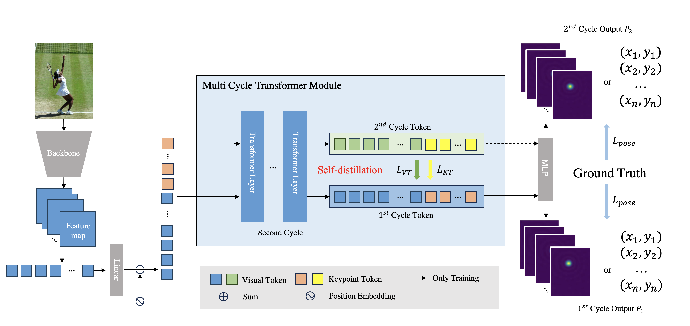

# SDPose: Tokenized Pose Estimation via Circulation-Guide Self-Distillation
Official Implementation for: SDPose: Tokenized Pose Estimation via Circulation-Guide Self-Distillation

> [**SDPose: Tokenized Pose Estimation via Circulation-Guide Self-Distillation**],            
> Sichen Chen\*, Yingyi Zhang\*, Siming Huang\*, Ran Yi, Ke Fan, Ruixin Zhang, Peixia Chen, Jun Wang, Shouhong Ding, Lizhuang Ma.  
> (\* equal contribution)

# Introdoction
Most of the top-performing transformer-based human pose estimation models are too computation-consuming and storage-demanding to deploy on edge computing platforms. Those transformer-based models that require fewer resources are prone to under-fitting due to their smaller scale and thus perform notably worse than their larger counterparts. Given this conundrum, we introduce ***SDPose***, a new self-distillation method for improving the performance of small transformer-based models. 

   


# Installation & Quick Start
SDPose referenced <a href="https://github.com/yshMars/DistilPose">DistilPose (CVPR 2023) </a> and is developed using MMPose and Pytorch framework. Please install the relevant packages listed below:
```
conda create -n sdpose python=3.8 pytorch=1.7.0 torchvision -c pytorch -y
conda activate sdpose
pip3 install openmim
mim install mmcv-full==1.3.8
git submodule update --init
cd mmpose
git checkout v0.29.0
pip3 install -e .
cd ..
pip3 install -r requirements.txt
```
For training on COCO, you will need to download the official COCO dataset and modify the dataset path in the model configuration files. After these setups, run the following command lines:
```
./tools/dist_train.sh configs/body/2d_kpt_sview_rgb_img/sdpose/coco/sdpose_s_v1_stemnet_coco_256x192.py 8
```
For evaluating on COCO, downlowd checkpoint and run the following command lines:
```
./tools/dist_test.sh configs/body/2d_kpt_sview_rgb_img/distilpose/coco/sdpose_s_v1_stemnet_coco_256x192.py \
./checkpoints/sdpose_s_v1.pth 8
```

# Models
## COCO Keypoint Detection Results
| Name | Param | GFLOPs | AP | download |
| ---- | ----- | ------ | -- | -------- |
|[SDPose-T](configs/body/2d_kpt_sview_rgb_img/sdpose/coco/sdpose_t_stemnet_coco_256x192.py)| 4.4 | 1.8 | 69.7 | [Download](https://1drv.ms/u/c/f50d4bfde1885ac3/EWA1nvaSsplDqxDJaLgm2QcBFXA_5O1GWNkfDvMeL2ZlLQ?e=36bqDS) |
|[SDPose-S-V1](configs/body/2d_kpt_sview_rgb_img/sdpose/coco/sdpose_s_v1_stemnet_coco_256x192.py)| 6.6 | 2.4 | 72.3 | [Download](https://1drv.ms/u/c/f50d4bfde1885ac3/Ea4EbwN0OMpBgneBaqrNDzABtYEWlWrRjt02ng27LpCtAg?e=XHoiLw) |
|[SDPose-S-V2](configs/body/2d_kpt_sview_rgb_img/sdpose/coco/sdpose_s_v2_stemnet_coco_256x192.py)| 6.2 | 4.7 | 73.5 | [Download](https://1drv.ms/u/c/f50d4bfde1885ac3/Ea4EbwN0OMpBgneBaqrNDzABtYEWlWrRjt02ng27LpCtAg?e=34AB06) |
|[SDPose-B](configs/body/2d_kpt_sview_rgb_img/sdpose/coco/sdpose_b_hr32_coco_256x192.py)| 13.2 | 5.2 | 73.7 | [Download](https://1drv.ms/u/c/f50d4bfde1885ac3/EUPQTbjUN9BKn9RjkRekphcBHj1hJ8jLVUYLLQOxuGyvww?e=Pkz8Pc) |
